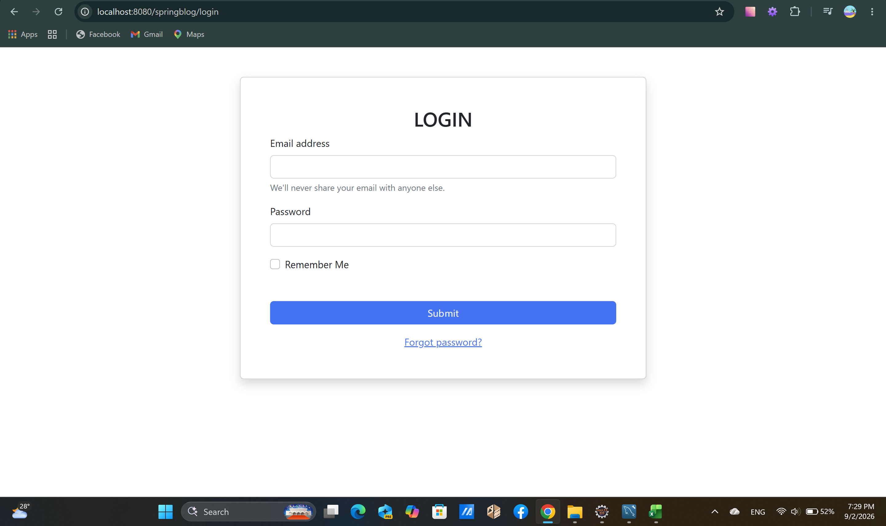
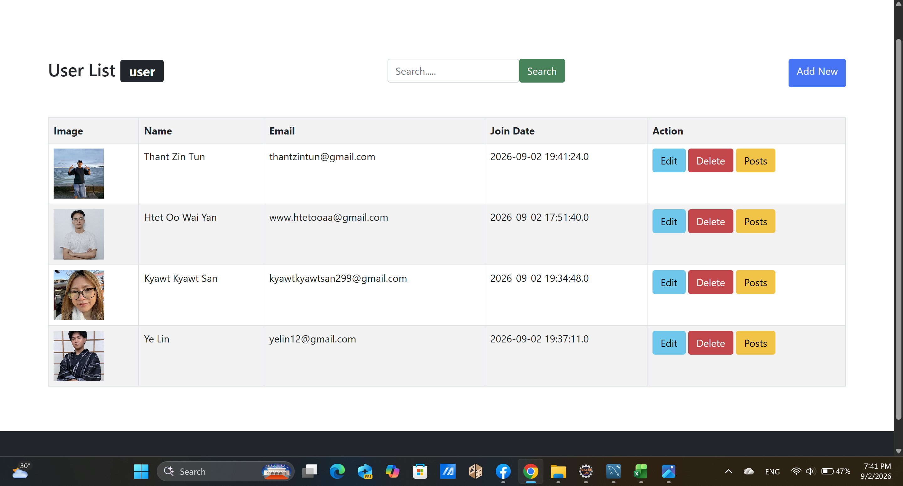
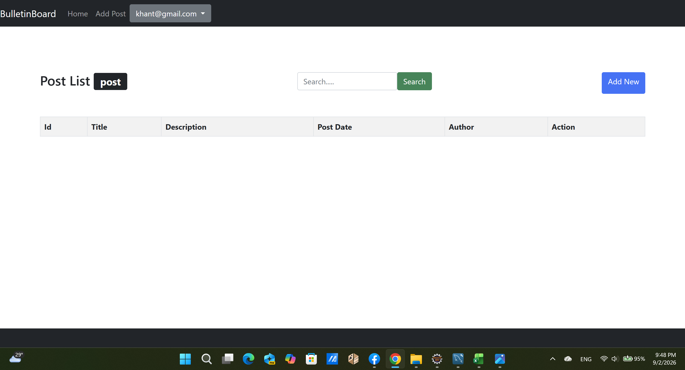
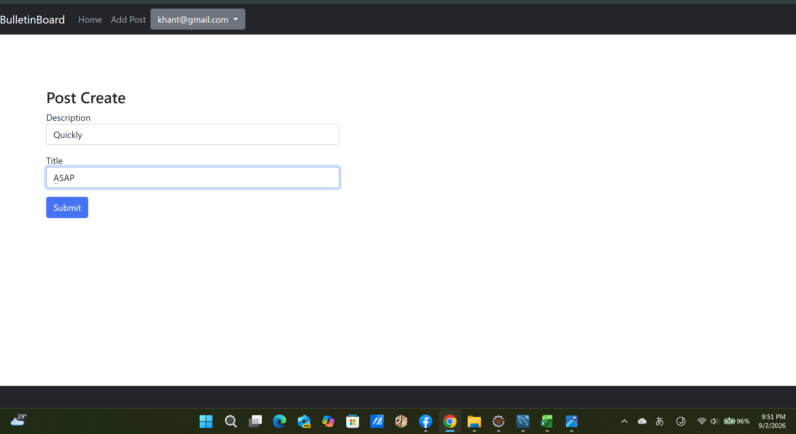
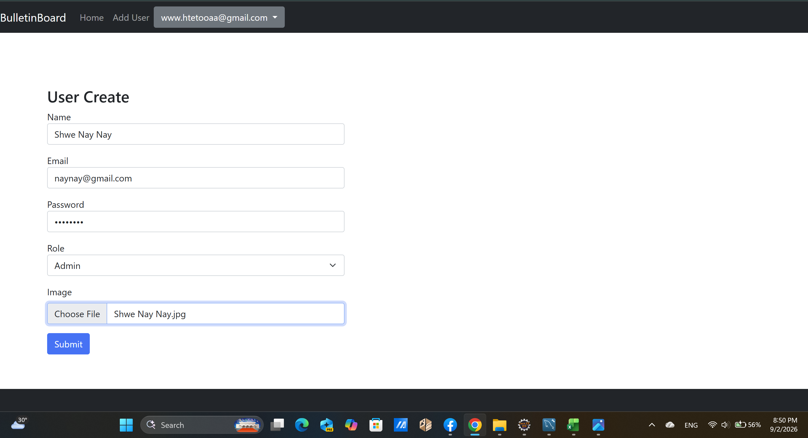
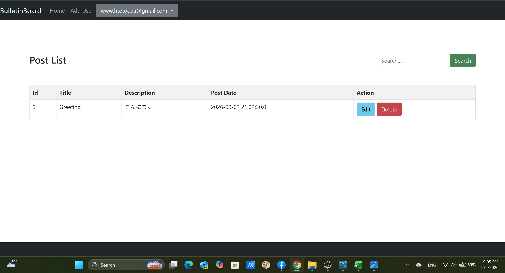
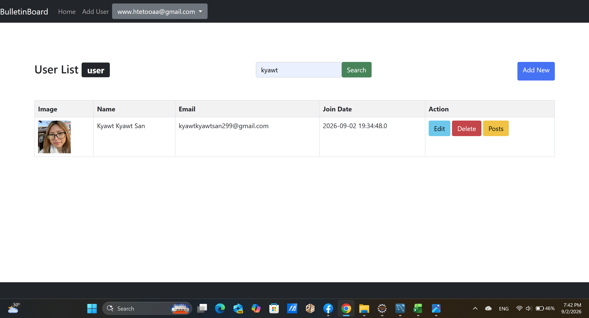
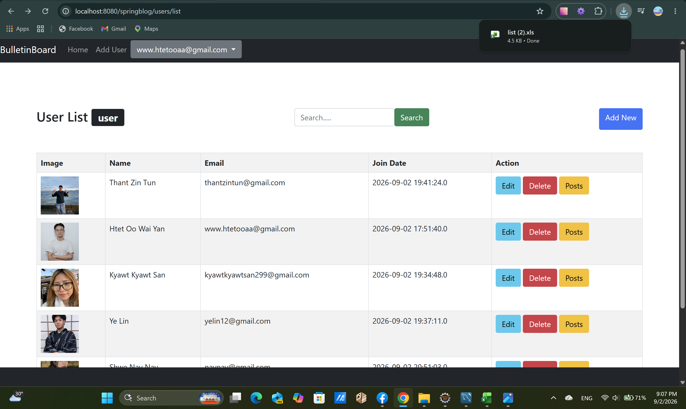
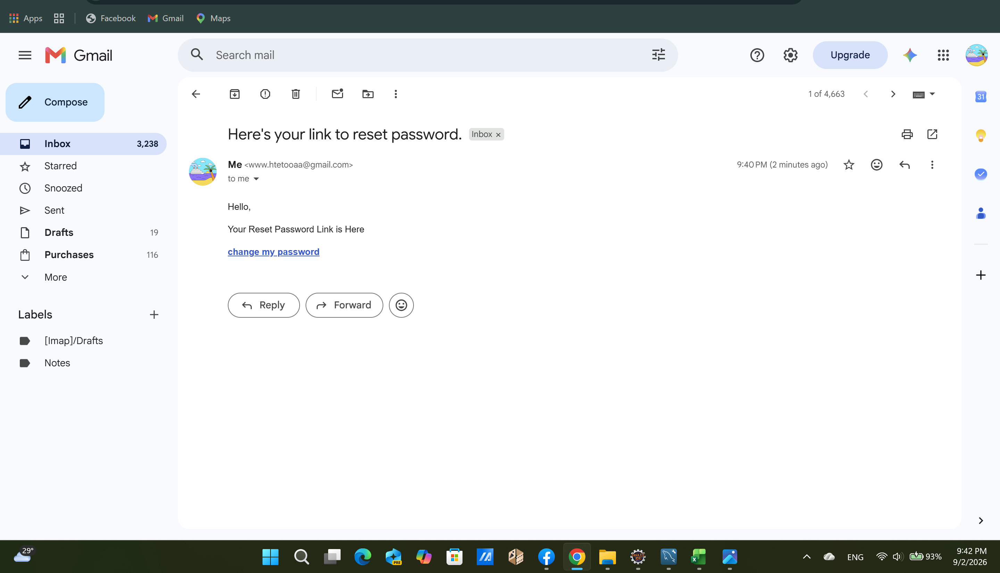
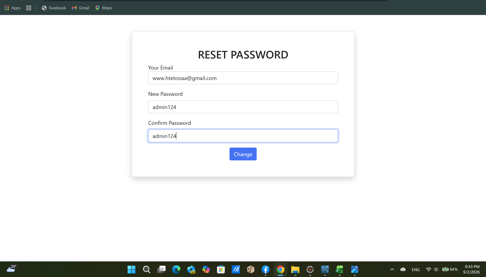

# Spring DAO Blog

A web-based blog application developed using Java and the Spring Framework.

This project implements a layered architecture using Spring MVC, Spring Security, Hibernate, MySQL, JSP, and JSTL. It provides user management, authentication, authorization, blog post management, password recovery, form validation, image upload, search, and Excel export functionality.

## Features

### Authentication & Authorization

- User login and logout
- Spring Security authentication
- Role-based authorization
- Admin and User roles
- BCrypt password encryption
- Password recovery via email
- Password reset using a secure reset token

### User Management

- Create users
- Edit user information
- Delete users
- Search users
- Upload user profile images
- Display user profile images
- Role assignment
- Export user information to Excel

### Blog Post Management

- Create blog posts
- View blog posts
- Edit blog posts
- Delete blog posts
- Search blog posts
- View posts by specific users
- User-based post ownership
- Users can manage only their own posts

### Validation

- Form validation using Bean Validation
- Required field validation
- Input error messages

## Technologies

### Backend

- Java 17
- Spring Framework 5.3
- Spring MVC
- Spring Security 5.8
- Hibernate ORM
- Hibernate Validator

### Database

- MySQL 8.0

### Frontend

- JSP
- JSTL
- HTML5
- CSS3
- Bootstrap

### Tools & Libraries

- Eclipse
- Apache Maven
- Apache Tomcat
- Git
- GitHub
- Lombok
- Apache POI
- JavaMail
- MySQL Connector/J

## Architecture

The application follows a layered architecture to separate responsibilities between the presentation, business, and data access layers.

Browser
   |
   v
Controller Layer
   |
   v
Service Layer
   |
   v
DAO Layer
   |
   v
Hibernate / JDBC
   |
   v
MySQL Database

### Controller Layer

Handles HTTP requests, form submissions, validation, and communication between the web interface and the service layer.

Examples:

- `UserController`
- `PostController`
- `ForgetPasswordController`

### Service Layer

Contains application business logic and coordinates operations between controllers and the DAO layer.

Examples:

- `UserService`
- `PostService`
- `RoleService`

### DAO Layer

Handles database operations such as creating, retrieving, updating, searching, and deleting data.

Examples:

- `UserDao`
- `PostDao`
- `RoleDao`

### Entity Layer

Represents database tables and relationships using JPA/Hibernate entities.

Examples:

- `User`
- `Post`
- `Role`

## Security

Spring Security is used to protect application resources and implement role-based access control.

### Roles

- `Admin`
- `User`

### Admin

Administrators can:

- Manage users
- Create users
- Edit users
- Delete users
- View user information
- View posts

### User

Users can:

- Login
- View posts
- Create their own posts
- Edit their own posts
- Delete their own posts
- View other users' posts
- Search users and posts
- Reset their password

Post ownership is checked using the currently authenticated user's ID.

## Password Security

User passwords are not stored as plain text.

Passwords are encrypted using:

`BCryptPasswordEncoder`

The password flow is:

Plain Password
      |
      v
BCryptPasswordEncoder
      |
      v
BCrypt Hash
      |
      v
MySQL

When a user creates or changes their password, the password is encoded using BCrypt before being stored in the database.

## Password Recovery

The application provides password recovery through email.

User
 |
 v
Forgot Password
 |
 v
Enter Email
 |
 v
Generate Reset Token
 |
 v
Send Email
 |
 v
Password Reset Link
 |
 v
Create New Password
 |
 v
BCrypt Encryption
 |
 v
Update Database

## Excel Export

The application can export user information to an Excel file using Apache POI.

Exported information includes:

- Name
- Email
- Created Date

## Image Upload

The application supports profile image uploads when creating or editing users.

Uploaded images are stored in:

`src/main/webapp/resources/img/`

The images can then be displayed in the user list.

## Screenshots

### Login

### User List

### User Home

### Create Post

### Admin - Create User

### Admin - View Other User's Posts

### Search User

### Export User List to Excel

### Password Reset Email

### Password Reset

## What I Learned

Through this project, I gained practical experience in:

- Java web application development
- Spring MVC
- Spring Security
- Hibernate
- MySQL
- Layered architecture
- Authentication and authorization
- Role-based access control
- CRUD operations
- Form validation
- BCrypt password encryption
- Email-based password recovery
- File upload
- Excel generation using Apache POI
- Git and GitHub

## Future Improvements

- Improve UI/UX design
- Add pagination for users and posts
- Improve post search functionality
- Improve error handling
- Add automated tests
- Improve security configuration
- Add post categories and tags
- Add user profile editing

## Author

**HTET OO WAI YAN**

GitHub: [htet-oo](https://github.com/htet-oo)
